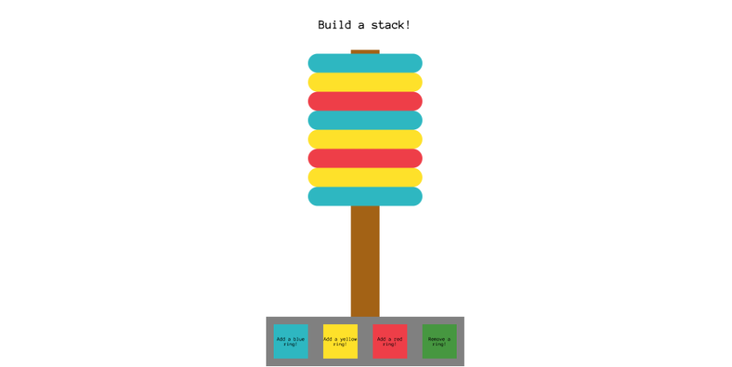
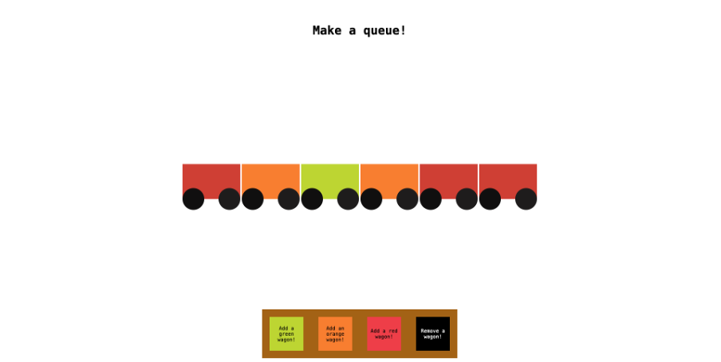

# Databases and data structures

This is a repository in which I have projects I've made in a course called Databases and data structures at Business College Helsinki.

Check out for example my stack app

- [Stack data structure app](https://github.com/satuhalinen/Databases_and_data_structures/tree/main/stack_data_structure_app)

and my queue app

- [Queue data structure app](https://github.com/satuhalinen/Databases_and_data_structures/tree/main/queue_data_structure_app)

